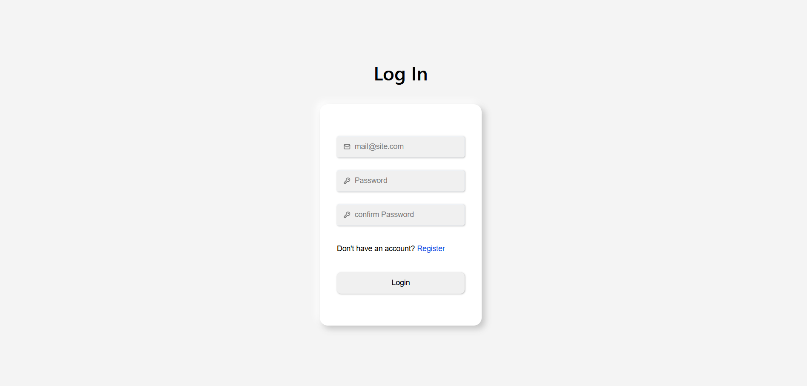
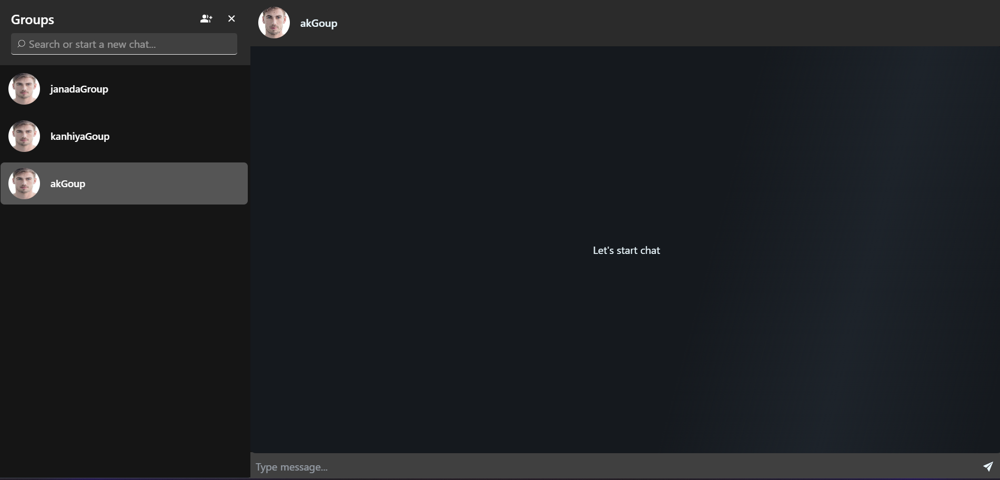
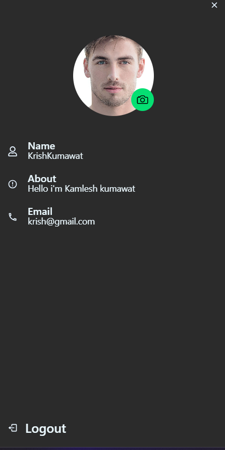
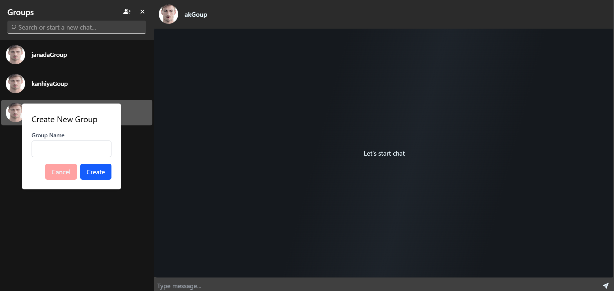

# Chat Application Frontend

This is the frontend for the Chat Application built using React and Vite. It provides a real-time chat interface with features like user authentication, private messaging, group chats, and online status tracking.

## Features

- **Real-time Messaging**: Send and receive messages instantly using Socket.IO.
- **User Authentication**: Secure login and registration with JWT-based authentication.
- **Group Chats**: Create and manage group chats.
- **Online Status**: View the online/offline status of users.
- **Search Functionality**: Search for users and groups.
- **Responsive Design**: Optimized for various screen sizes using TailwindCSS.

## Technologies Used

- **React**: For building the user interface.
- **Vite**: For fast development and build tooling.
- **Redux Toolkit**: For state management.
- **Socket.IO**: For real-time communication.
- **TailwindCSS**: For styling.
- **DaisyUI**: For pre-designed UI components.
- **Axios**: For making API requests.

## File Structure

```
Frontend/
├── src/
│   ├── auth/                # Authentication components
│   ├── config/              # Configuration files (e.g., Axios, Socket.IO)
│   ├── context/             # React Context for global state
│   ├── redux/               # Redux slices and store
│   ├── routes/              # Application routes
│   ├── screens/             # UI components for different screens
│   ├── statemange/          # Custom hooks for state management
│   ├── App.jsx              # Main application component
│   ├── main.jsx             # Entry point for the React app
│   └── index.css            # Global styles
├── vite.config.js           # Vite configuration
├── package.json             # Project metadata and dependencies
└── README.md                # Documentation for the frontend
```

## Installation

1. Clone the repository:
   ```bash
   git clone https://github.com/Kamleshkumawt/Chat-application.git
   ```
2. Navigate to the frontend directory:
   ```bash
   cd Frontend
   ```
3. Install dependencies:
   ```bash
   npm install
   ```

## Usage

1. Start the development server:
   ```bash
   npm run dev
   ```
2. Open the application in your browser at `http://localhost:5173`.

## Scripts

- `npm run dev`: Starts the development server.
- `npm run build`: Builds the application for production.
- `npm run preview`: Previews the production build.
- `npm run lint`: Runs ESLint to check for code quality issues.

## Screenshots

### [Desktop Web](https://github.com/Kamleshkumawt/Chat-application)

<p align="center">
  
</p>


<p align="center">
  
</p>


<p align="center">

</p>


<p align="center">
  
  
</p>


## Contributing

Contributions are welcome! Please follow these steps:
1. Fork the repository.
2. Create a new branch for your feature or bugfix.
3. Commit your changes and push the branch.
4. Submit a pull request.

### License

* Demo avatars and some other graphics are from https://daisyui.com/ under [CC0 license](https://daisyui.com/). 
* icons are from https://react-icons.github.io/react-icons/ under [Apache 2.0](https://www.apache.org/licenses/LICENSE-2.0.html) license.

